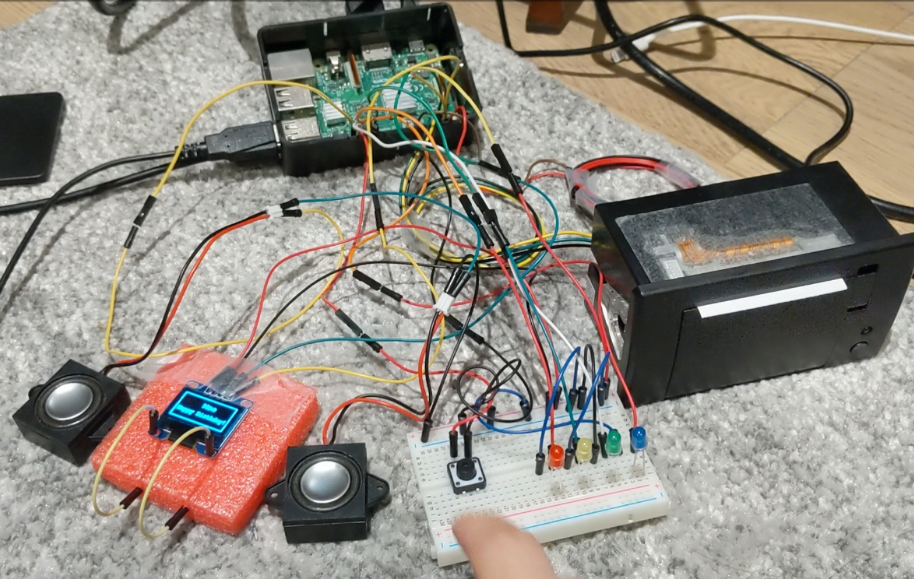

# Raspberry Pi For Happy Birthday

This is a small birthday gift for Moe. It includes:

*   Raspberry Pi 3
*   1 button
*   1 120 * 60 LED screen
*   2 speaker(3W)
*   4 LED lights
*   1 Thermal Printer

This is how it looks like:

When you push the button, the speakers will play Happy Birthday song, and the the LED screen will display words like "Moe Happy Birthday". At the same time, the printer will print a image together with words. The music and printing will finish almost at the same time, and then 4 led lights will start to blink for a while, just like fireworks.

You can buy the printer [here](https://www.adafruit.com/product/597). All other parts are kind of normal. In the first design there was a http module, but did not finish at last.

Run `main.py` to launch the program. Because of the compatability issue with library, you need to use Python 2.
